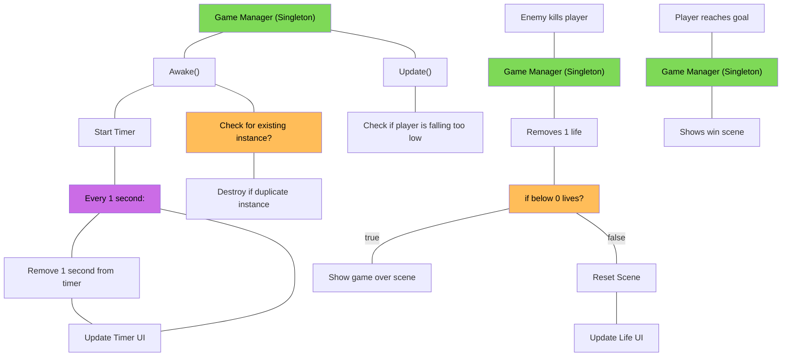

Scott Murphy - 100826964

### Project
My project is called "Ultra Guy: Sandwich Fiend", and it is a basic 2D platformer. 
You must scale the treacherous terrain and avoid hangry guys that are fiending for your sandwich. 

### Diagram - Singleton


### Answers - Singleton:
I chose to use a Singleton to create a Game Manager that manages aspects of the game. I decided to do a Game Manager class as a singleton because there are only supposed to be one of them, and I want it to persist across scenes to save data. 

I think that this is a beneficial way to do a Singleton because it will allow me to build it out when I add more features into the game. The Game Manager should be able to be accessed from anywhere, and it should be able to persist across scenes to save it's data since it is the object that is controlling some of the game states.


### Diagram - Factory
```
flowchart
	n1["Factory"]
	n1["ObjectFactory"]
	n2["ISpawnable"]
	n1 --- n3["CreateObject<T>(position) where T : ISpawnable"]
	n3 --- n4["Spawn the object."]
	n2 --- n5["Spawn() --> spawns the object"]
	n2 --- n6["Initialize() --> initializes any properties I might want with the object"]
	n6 --- n7["in this case, starts the object with a Vector2 force applied"]
	n2 --- n8["Despawn() --> despawns the object"]
	n5
	n9["Cannon Class"]
	n9["Cannon Class (Example spawner)"] --- n10["Uses ObjectFactory to spawn SpikeBall"]
	n10 --- n11["Initializes Spikeball speed through ISpawnable.Initialize()"]
```

### Answers - Week 2:

I decided to go with a factory that could be used to spawn any number of objects, but for the sake of the question, mostly enemy objects. I used a static ObjectFactory class with a CreateObject<T>() method that can spawn objects that have the ISpawnable interface implemented. It calls Spawn() on the object, then Initialize() to initialize any properties that I would want to spawn on the object.

The factory is a good choice for spawning these objects because there can be a need for any number of them in the game at any given time. With the way I created it, it is able to spawn any object that has the ISpawnable interface on it with custom properties that I can implement later on.